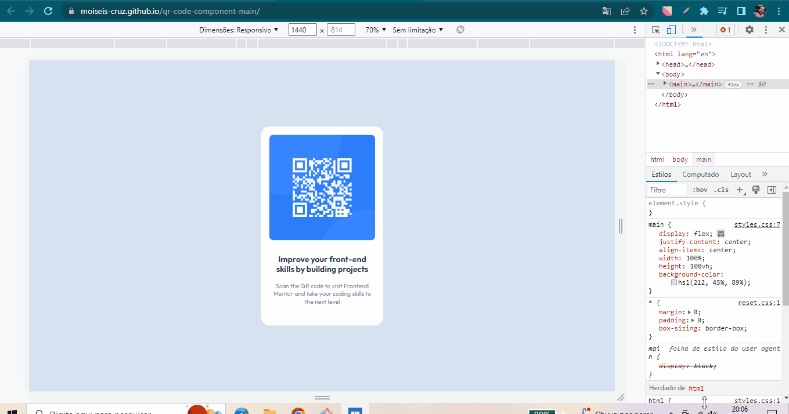

# qr-code-component-main

Desafio onde testei um pouco das minhas habilidades. Com algumas tags, por exemplo, main, div, img dentre outras. 
 E, algumas propriedades CSS, como por exemplo, "display: flex;", margin, padding, entre outras. 
 Esse é o meu primeiro projeto criado para adicionar ao meu portfólio. Desafio do Frontend Mentor.

## Tecnologias Ultilizadas:

- HTML;
- CSS;

## Tempo de conclusão

Levei, aproximadamente 35 minutos para concluir.

